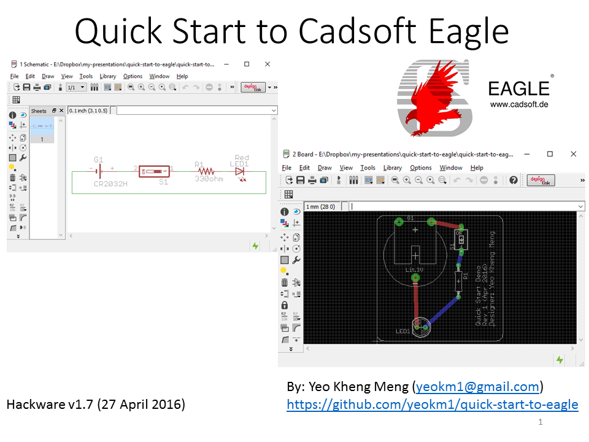

# quick-start-to-eagle
A talk I gave at [Hackware v1.7](https://www.facebook.com/events/180525638991544/) about introducing people to the basics of using Eagle.

##Video of this talk

My slides are available on slideshare using the picture link below.

The content of this talk is a [reduced version of a completed class](https://github.com/yeokm1/intro-to-pcb-design-eagle) I gave before.

